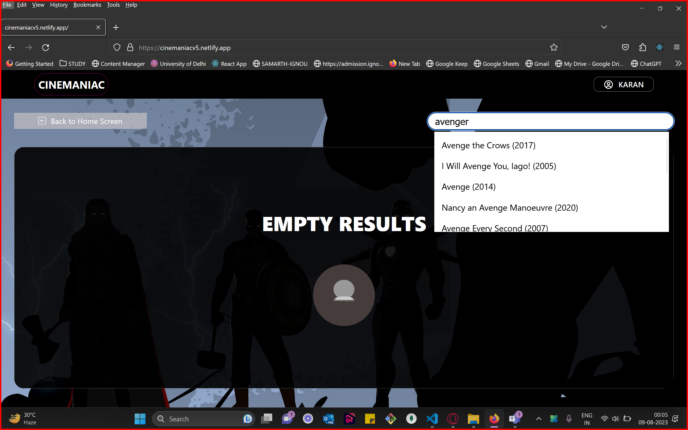

# Welcome to Cinemaniac: Your Movie Lover's App

Cinemaniac is the ultimate app for movie enthusiasts. Discover and save your favorite movies to personalized playlists with easy sign-up and login functionality.

Features:

* Explore Effortlessly: Dive into a vast collection of films across genres.

* Create Playlists: Craft your own playlists for any mood or theme.

* Simple Sign-up: Securely sign up to access and save your movie preferences.

* Elevate your movie-watching experience with Cinemaniac. Download now and curate your perfect film collection. 


## Installation

Install Cinemaniac with npm
* Server(NodeJs) 

```bash
  cd server 
  npm install 
  
```
* Client(ReactJs) 

```bash
  cd client 
  npm install 
  
```

## Usage

Run the project using the following command:

```sh
   npm run start

```

## ScreenShots

* Homepage

* LogInScreen

* MoviesSearch

* Playlists

* MoviesDetails

    

